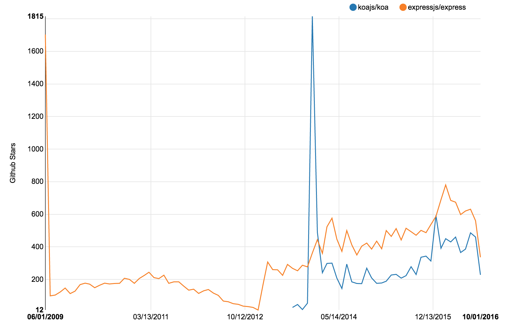

## 说明

以 [star-history](https://github.com/timqian/star-history) 为基础，统计的内容修改为每个月的 Star 数

Star 数太多的 Repo 可能会挂~ 请求数有限制

https://zoeyyoung.github.io/star-stat/#reflux/refluxjs&facebook/relay&reactjs/redux&facebook/flux&goatslacker/alt&acdlite/flummox&yahoo/fluxible&voronianski/flux-comparison&kenwheeler/mcfly&azu/material-flux

## 参考资源

https://github.com/timqian/star-history

https://developer.github.com/v3/activity/starring/#list-stargazers
